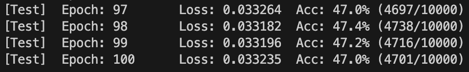
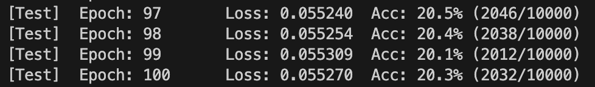
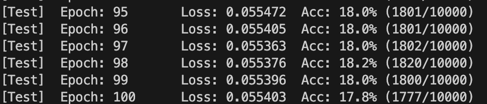

## TensorShield-artifacts

## Introduction

---

TensorShield is an efficient on-device inference framework that selectively shields partial tensors of a model while achieving near-complete defense against both model stealing (MS) and membership inference attacks (MIA).

* `./model-stealing_demo`: Contains the demonstration code for the model stealing attack on ResNet18, used in Figure 11 and Figure 12.
* `./model-stealing`, `./membership-inference`, `./otherXAI`: Contain the MS and MIA attack implementations and scripts for TensorShield and various baselines, used in Figure 9, Figure 10, Figure 11, and Figure 12.
* `./Hikey960`: Includes the TensorShield deployment code for the Hikey960 mobile device, supporting results in Figure 9, Figure 14, Table 3, Figure 15, and Table 4.
* `./RPI3B`: Includes the TensorShield deployment code for the Raspberry Pi 3B device, supporting results in Figure 9, Figure 14, Figure 15, and Table 4.


### Requirements
#### Environment
- Python 3.9
- Pytorch 2.1.1

Can be set up as:
```
$ pip install -r requirements.txt
```


---

## Quick Start

### 1. Clone the Repository

```bash
git clone https://github.com/suntong30/TensorShield.git
cd ./knockoffnets_demo
export PYTHONPATH=../:$PYTHONPATH
```

### 2. Train the Victim Model

```bash
python3 knockoff/victim/train.py CIFAR100 resnet18 -d 0 -o models/victim/cifar100-resnet18 -e 20 --pretrained imagenet
```

The victim model will be saved in the `./models/victim/cifar100-resnet18` directory.

### 3. Set Up the Transfer Set

```bash
python3 knockoff/adversary/transfer.py random models/victim/cifar100-resnet18 --out_dir models/adversary/cifar100-resnet18-random --budget 5000 --queryset CIFAR100 --batch_size 32 -d 0
```

### 4. Train the Shadow Model

#### Step 1: Add the Victim Model Path

In `./knockoff/models/zoo.py`, locate the following snippet and update the `checkpoint_path` to point to your victim model:

```python
if modelname == 'resnet18':
    checkpoint_path = ''  # e.g., /home/knockoffnets/models/victim/cifar100-resnet18/checkpoint.pth.tar
    trained_state_dict = torch.load(checkpoint_path)['state_dict']
```

#### Step 2: Choose the Protection Setting

You can choose from three settings: **White-box**, **Black-box**, or **TensorShield**.


##### White-box (Default: All Parameters Are Stolen)

In `def get_imagenet_pretrainednet(...)`, use the following logic to copy all weights:

```python
if True:  # All parameters are copied (white-box)
    attr = new_model
    for part in parts[:-1]:
        attr = getattr(attr, part, None)
        assert attr is not None
    print(key, 'stolen')
    if attr is not None:
        param_name = parts[-1]
        if hasattr(attr, param_name):
            existing_param = getattr(attr, param_name)
            existing_param.data.copy_(param.data)
```

Launch the attack:

```bash
python3 knockoff/adversary/train.py models/adversary/cifar100-resnet18-random resnet18 CIFAR100 --budgets 1000 -d 0 --pretrained imagenet --log-interval 100 --epochs 100 --lr 0.01
```

The shadow model will be saved in `./models/adversary/cifar100-resnet18-random/`.

Attack Accuracy (White-box):



##### Black-box (All Parameters Protected)

In `def get_imagenet_pretrainednet(...)`, set the condition to prevent any parameters from being copied:

```python
if False:  # No parameters are copied (black-box)
    ...
```

Launch the attack: using the same command as above. The shadow model will again be saved in `./models/adversary/cifar100-resnet18-random/`.
Attack Accuracy (TensorShield):



##### TensorShield (Critical Tensors Protected)

In `def get_imagenet_pretrainednet(...)`, copy only *non-critical* tensors:

```python
if 'layer1.1.conv1.weight' not in key and 'layer2.0.conv1.weight' not in key and 'layer1.0.conv1.weight' not in key \
    and 'layer1.1.conv2.weight' not in key and 'layer1.0.conv2.weight' not in key and 'layer2.0.conv2.weight' not in key \
    and 'layer2.1.conv1.weight' not in key and 'layer2.1.conv2.weight' not in key and 'layer3.0.conv1.weight' not in key \
    and 'last_linear.weight' not in key and 'last_linear.bias' not in key:
    
    attr = new_model
    for part in parts[:-1]:
        attr = getattr(attr, part, None)
        assert attr is not None
    print(key, 'stolen')
    if attr is not None:
        param_name = parts[-1]
        if hasattr(attr, param_name):
            existing_param = getattr(attr, param_name)
            existing_param.data.copy_(param.data)
```

Launch the attack:

```bash
python3 knockoff/adversary/train.py models/adversary/cifar100-resnet18-random resnet18 CIFAR100 --budgets 1000 -d 0 --pretrained imagenet --log-interval 100 --epochs 100 --lr 0.01
```

The shadow model will be saved in `./models/adversary/cifar100-resnet18-random/`.

Attack Accuracy (TensorShield):



---

## Attack Scripts

The `./model-stealing` folder contains the implementation of the model stealing attack.
The evaluated datasets and architectures are specified in `./model-stealing/j_process.py`:

```python
def run():
    # Datasets to evaluate
    datasets = ['cifar100']
    # Model architectures to evaluate
    archs = ['resnet18']
```

To launch the attack, run:

```bash
python3 j_process.py
```

Similarly, the Membership Inference Attack (MIA) script can be found in the `./membership-inference/scripts` folder.

Other XAI baselines are provided in the `other_XAI`, `other_XAI_grad`, and related folders.


## On-device inference

Our inference code is based on [`https://github.com/mofanv/darknetz.git`](https://github.com/mofanv/darknetz.git). The original `darknetz` repository is preserved, but **the `ta` folder is fully replaced with the version from this project**.

### Step 1: Setup

First, follow the original instructions from [darknetz README](./README.md) to set up the environment.

Then, **replace the entire `ta` directory** in `darknetz` with the `ta` directory from this project.

Other files from this project (e.g., `host`) should be deployed and compiled **on the `hikey960` board**, where `darknetp` will be built. The necessary code should already exist on the `hikey960`.

---

### Step 2: On `hikey960`

Assuming you have copied the compiled `darknetp` binary to `/usr/local/bin/`, follow the instructions below.

Examples of usage:

```bash
# Example 1: Basic classification, CPU-only, with optional ReLU obfuscation.
darknetp classifier function datasets_config model_config model_weights figure -nogpu (or not) -tuse_tee_relu 0/1

# Example 2: ReLU obfuscation with GPU, using AlexNet (path may vary; check history on hikey960)
darknetp classifier predict cifar.data cfg/alexnet_224.cfg backup/alexnet_224.start.conv.weights /root/data/cifar/train/1000_truck.png -tuse_tee_relu 1

# Example 3: Layer-by-layer loading (all layers), CPU-only
darknetp classifier predict_per_layer cifar.data cfg/alexnet_224.cfg backup/alexnet_224.start.conv.weights /root/data/cifar/train/1000_truck.png -layer 999 -nogpu

# Example 4: Standard GPU inference without obfuscation
darknetp classifier predict cifar.data cfg/alexnet_224.cfg backup/alexnet_224.start.conv.weights /root/data/cifar/train/1000_truck.png
```

---

### Step 3: Demo Mode

Our proposed approach supports demo runs for various models:

* `-demo 1`: ResNet18
* `-demo 2`: VGG-BN
* `-demo 3`: ResNet50
* `-demo 4`: MobileNetV2

#### To enable or disable linear obfuscation:

Modify line 24 in `/home/user/darknet_tee/host/src/parser.h`:

```cpp
// #define RUN_FUSION  // Comment to disable fusion (i.e., disable obfuscation)
```

After changing the above, **recompile on the `hikey960`**.

Examples:

```bash
# ResNet18 without obfuscation, using GPU
# Make sure RUN_FUSION is commented out
darknetp classifier predict_demo cifar.data cfg/resnet18.cfg backup/resnet18.start.conv.weights /root/data/cifar/train/1000_truck.png -demo 1

# ResNet18 with linear obfuscation, using GPU
# Make sure RUN_FUSION is enabled and recompiled on hikey960
darknetp classifier predict_demo cifar.data cfg/resnet18.cfg backup/resnet18.start.conv.weights /root/data/cifar/train/1000_truck.png -demo 1 -tuse_tee_relu 1
```

> **Note**: Please verify the correct paths to `data`, `cfg`, `weights`, and input images, as they may vary depending on your environment and storage layout.


---
##  Acknowledge
- knockoffnets https://github.com/tribhuvanesh/knockoffnets
- ML-Doctor https://github.com/liuyugeng/ML-Doctor
- TEESlice https://github.com/ziqi-zhang/TEESlice-artifact
- DarkneTZ https://github.com/mofanv/darknetz